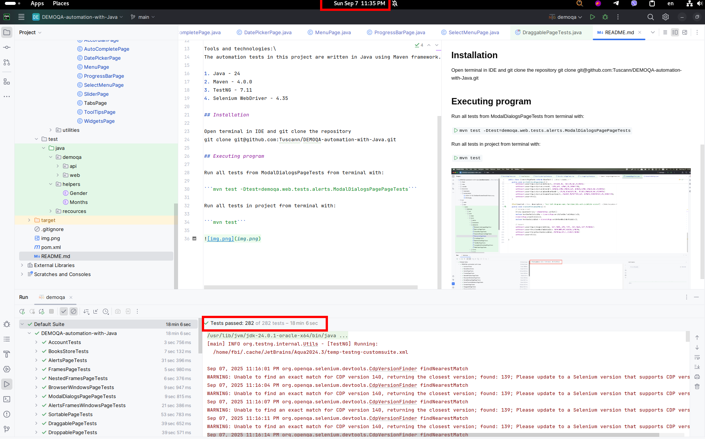

# Test automation project for [DemoQA](https://demoqa.com) using Java

<p align="center">

</p>

> DemoQA is a demo site for QA engineers, learning selenium.\
> Made by Tools QA.\
> Consists of website with training forms and example of bookshop with open API.


Tools and technologies:\
The automation tests in this project are written in Java using Maven framework.

1. Java - 24
2. Maven - 4.0.0
3. TestNG - 7.11
4. Selenium WebDriver - 4.35

## Installation

Open terminal in IDE and git clone the repository
git clone git@github.com:Tuscann/DEMOQA-automation-with-Java.git

## Executing program

Run all tests from ModalDialogsPageTests from terminal with:

```mvn test -Dtest=demoqa.web.tests.alerts.ModalDialogsPagePageTests```

Run all tests in project from terminal with:

```mvn test```

